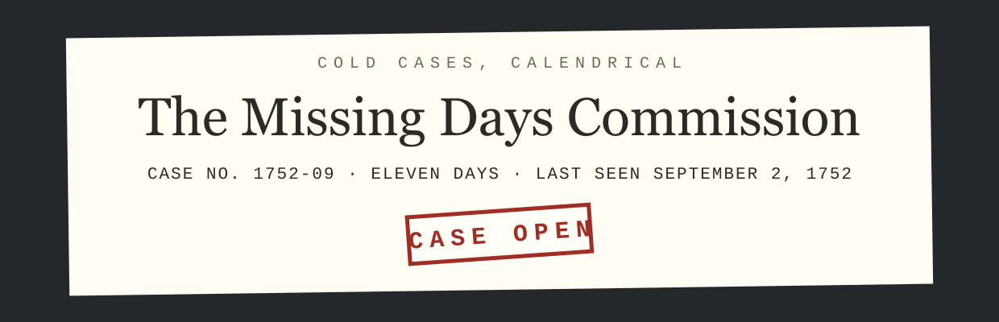

<p align="center">
  
</p>

<p align="center">
  <strong>Cold cases, calendrical.</strong><br>
  Case No. 1752-09 &middot; Eleven days &middot; Last seen: Wednesday, September 2, 1752.
</p>

---

This repository contains the public site for The Missing Days Commission
(missingdays.org, candidate domain, not yet purchased), the standing
inquiry into the disappearance of September 3 through 13, 1752, eleven
days that went to bed Julian and never woke up.

## The Case

The official account blames the Calendar (New Style) Act 1750, which
moved Britain and its colonies from the Julian to the Gregorian calendar
and deleted eleven days to correct a drift of centuries. The Commission
accepts this account and keeps the case open anyway, on principle.
Reward for information: eleven days, payable in kind, never.

## What the site actually does

Everything runs client-side and the calendar facts are real:

* **Exhibit A** is `cal 9 1752`, which any Unix system will reproduce on
  request: September 1752 jumps from the 2nd to the 14th. The gap is not
  a rendering error; it is the scene of the incident, preserved in every
  POSIX system as a matter of record.
* **The records service** takes any date and pronounces on it: dates in
  the gap are MISSING; February 30, 1712 is CONFIRMED, SWEDEN ONLY, as a
  correction to a correction; British dates before the changeover are
  confirmed Old Style, eleven days out of step with most of Europe, a
  condition the era referred to as normal.
* **The adjacent incidents** are genuine: Sweden's one-time February 30,
  and the "Give us our eleven days" riots, which modern historians trace
  largely to a Hogarth painting. The Commission cannot confirm the riots.
  The Commission understands the impulse.

---

## Development notes

The parody ends here. The rest of this file is accurate.

### Layout

A static, zero-build, zero-dependency site. Two HTML files and a handful
of generated images. There is no framework, no bundler and no
`package.json`. Cloudflare Pages serves the repository root exactly as it
appears here.

```
index.html            the site, exhibit and records service included
404.html              catch-all, served automatically by Cloudflare Pages
favicon.svg           icon source of truth (64px grid)
favicon.ico           16/32/48, generated
apple-touch-icon.png  180x180, generated
og.png                1200x630 share image, generated
assets/logo.svg       wordmark, text outlined, used at the top of this README
tools/og.html         source for og.png
tools/logo-src.svg    source for assets/logo.svg, text still live
tools/favicon-16.svg  pixel-grid 16px icon, used for the smallest .ico entry
Makefile              asset regeneration only, never runs at deploy time
_headers              Cloudflare Pages header rules
robots.txt            permissive
wrangler.toml         Cloudflare Pages configuration
mise.toml             pins the Wrangler version used to deploy
```

The page makes zero requests to any external domain. Body type is Courier
New with Courier fallbacks and headings are Georgia with serif fallbacks,
so there are no webfonts to host or wait for.

### The production domain

`missingdays.org` is a candidate; the domain has not been purchased. It
is hardcoded, deliberately, and nothing derives it from anything else:

| File | What to change |
| --- | --- |
| `index.html` | `rel=canonical`, `og:url`, `og:image`, `twitter:image` |
| `404.html` | nothing, the 404 uses only root-relative paths |
| `tools/og.html` | the domain printed in the footer of the share image |
| `README.md` | this table, and the mentions above it |

After changing `tools/og.html`, re-run `make og`.

### Local preview

```sh
make serve          # python3 -m http.server 8000
```

Then open `http://localhost:8000`. A local server is preferable to opening
the file directly because the icon paths are root-absolute.

### Regenerating images

Only needed when the wordmark, the icon or the share image changes.
Requires `google-chrome`, ImageMagick 7 (`magick`) and Inkscape on the
machine doing the regenerating; none of them is needed to deploy, because
the outputs are committed. The serif renders want a real Georgia on the
fontconfig path; this machine has one in `~/.local/share/fonts`. Courier
New resolves through fontconfig to Liberation Mono, which is
metric-compatible, so the rendered assets match what most non-Apple
visitors see in the browser.

```sh
make assets         # everything below
make og             # og.png     <- tools/og.html, via headless Chrome
make favicon        # favicon.ico + apple-touch-icon.png <- the SVG sources
make logo           # assets/logo.svg <- tools/logo-src.svg, text outlined
```

`make logo` outlines the wordmark's text so the README renders the same
whether or not the viewer has Georgia or a Courier. Inkscape rewrites the
whole file, so the `GENERATED` comment at the top has to be pasted back
afterwards.

### Deploying

Wrangler is configured via `wrangler.toml`, so a deploy is one command
from an authenticated shell:

```sh
make deploy         # wrangler pages deploy .
```

The Wrangler version is pinned by `mise.toml` (this machine manages its
Wrangler through [mise](https://mise.jdx.dev/); the global config tracks
`latest`, the repo pins an exact version). To move the pin, edit
`mise.toml`, run `mise install`, and deploy once to confirm nothing moved
underneath.

### Which Cloudflare account this deploys to

This machine has two Cloudflare identities, and picking the wrong one
deploys this site into an unrelated organisation.

**Pages configuration cannot pin the account.** `account_id` is a
Workers-only key; putting it in a Pages `wrangler.toml` makes Wrangler
refuse to run. So the account is selected by **an auth profile bound to
this directory**, recorded in
`~/.config/.wrangler/profiles/directory-bindings.json`:

```sh
wrangler auth activate personal    # already done; re-run after moving the repo
wrangler whoami                    # must print: Active profile: personal
```

Without a binding, Wrangler falls back to the `default` profile, which
here is the other organisation, and it will deploy there without asking.
**Check `whoami` before deploying.** The binding lives outside the repo,
so a fresh clone, a moved directory, or another machine all need
`wrangler auth activate` again.

One extra trap: Wrangler caches the resolved account in the untracked
`.wrangler/cache/wrangler-account.json` inside this directory. If a deploy
ever went to the wrong account from here, activating the right profile is
**not** enough; delete `.wrangler/` as well, or the cached account ID wins
and the API call fails with `Authentication error [code: 10000]`.

For CI, where profiles do not exist, set `CLOUDFLARE_ACCOUNT_ID` (the
account to deploy into) and `CLOUDFLARE_API_TOKEN` (credentials scoped to
it) as environment variables.

The Pages project is `missingdays`, production branch `main`, with no
build command and the build output directory set to `/`. If you ever
recreate it from the dashboard, use exactly those values; there is
nothing to build, and any build command entered there will only make the
deployment worse.

To wire the Git integration instead, connect the
`holthe/missing-days-commission` repository under **Workers & Pages ->
Create -> Pages -> Connect to Git** with the same settings. Note that the
repository name is hyphenated and the Pages project name is not; the
project name matches the domain.

### Custom domain

Deploy at least once first, so the project exists. Then, once
`missingdays.org` (or whatever the site ends up on) is actually
registered:

1. **Add the zone to Cloudflare**, unless the domain was bought through
   Cloudflare, in which case it is already there. Dashboard -> **Add a
   site** -> the domain -> Free plan. Repoint the registrar's nameservers
   at the two Cloudflare ones and wait for the zone to go active.
2. **Attach the domain to the Pages project.** Dashboard -> **Workers &
   Pages** -> `missingdays` -> **Custom domains** -> **Set up a custom
   domain**. Because the zone is on Cloudflare, the required CNAME record
   (apex, flattened, proxied, pointing at `missingdays.pages.dev`) is
   created for you. **Do not create the record by hand first**; a
   pre-existing CNAME blocks the flow outright.
3. **Repeat for `www`** if both should resolve.
4. **Wait for the certificate.** Issuance normally completes within a few
   minutes of the record appearing.

Until then the site is reachable at `missingdays.pages.dev`.

### Related

The Commission is a division of
[Best Effort Industries](https://besteffortindustries.com) and is
registered as division 012 in the operating divisions table in that
repository's `index.html`, in agreement with the document number in the
site's own footer, an alignment the Commission regards as suspicious and
has opened a file on.

## License

Parody. The Act is real, the gap is real, `cal` will testify, and the
Commission is the only party involved that never existed.
